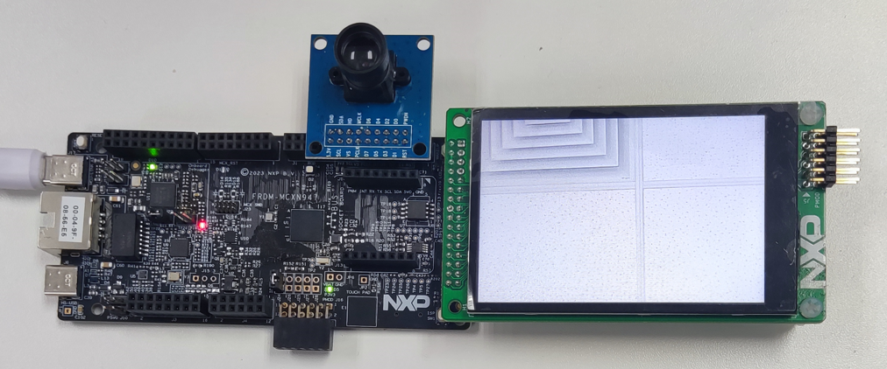
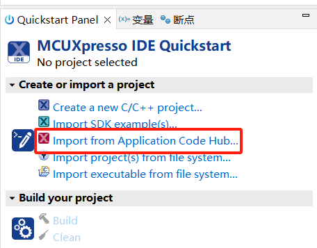

# NXP Application Code Hub

## AN14191: How to Use SmartDMA to Implement Camera Interface in MCXN MCU
This software accompanies application note [AN14191](https://www.nxp.com.cn/docs/en/application-note/AN14191.pdf).This application note describes the parallel interface for the camera solution in MCXN947 andMCXN236. It includes the introduction of camera interface, features, API routines, and demo.

This application note describes the parallel interface for the camera solution in MCXN947 and MCXN236. It includes the introduction of camera interface, features, API routines, and demo. MCXN947 and MCXN236 contain a coprocessor SmartDMA, which can be used to implement the camera interface.

#### Boards: FRDM-MCXN947
#### Categories: HMI, Graphics, Vision, Camera
#### Peripherals: DMA, FlexIO, VIDEO, SmartDMA
#### Toolchains: MCUXpresso IDE

## Table of Contents
1. [Software](#step1)
2. [Hardware](#step2)
3. [Setup](#step3)
4. [Results](#step4)
6. [Support](#step5)
7. [Release Notes](#step6)

## 1. Software
- [MCUXpresso IDE V11.10 or later](https://www.nxp.com/design/design-center/software/development-software/mcuxpresso-software-and-tools-/mcuxpresso-integrated-development-environment-ide:MCUXpresso-IDE).
- SDK_2_16_000_FRDM-MCXN947
- MCUXpresso for Visual Studio Code: This example supports MCUXpresso for Visual Studio Code, for more information about how to use Visual Studio Code please refer [here](https://www.nxp.com/design/training/getting-started-with-mcuxpresso-for-visual-studio-code:TIP-GETTING-STARTED-WITH-MCUXPRESSO-FOR-VS-CODE).

## 2. Hardware
- Type-C USB cable
- FRDM-MCXN947
- Personal Computer
- Camera module: OV7670
- LCD module: LCD-PAR-S035

## 3. Setup
### 3.1 Step 1

Connect camera module to J9 header of FRDM-MCXN947, connect LCD module to J8 of FRDM-MCXN947 as shown below:

### 3.2 Step 2

- Import the project to MCUXpresso IDE.

1. Open MCUXpresso IDE, in the Quick Start Panel, choose **Import from Application Code Hub**.

   ​	

2. Enter the demo name in the search bar.

    

3. Click **Copy GitHub link**, MCUXpresso IDE will automatically retrieve project attributes, then click **Next>**.

   ​	

4. Select **main** branch and then click **Next>**, Select the MCUXpresso project, click **Finish** button to complete import.

   ​	

- Connect the micro USB cable between the PC host and the USB port (J17) on the board.
- Compile and download to the board.
- Reset and run.

## 4. Results
Reset the board, the camera video displays on the screen as below:

​	

## 5. Support
*Provide URLs for help here.*

#### Project Metadata

<!----- Boards ----->

<!----- Categories ----->

<!----- Peripherals ----->

<!----- Toolchains ----->

Questions regarding the content/correctness of this example can be entered as Issues within this GitHub repository.

>**Warning**: For more general technical questions regarding NXP Microcontrollers and the difference in expected functionality, enter your questions on the [NXP Community Forum](https://community.nxp.com/)

## 6. Release Notes
| Version | Description / Update                           | Date                        |
|:-------:|------------------------------------------------|----------------------------:|
| 1.0     | Initial release on Application Code Hub        | July 31st 2024 |

## Licensing

*If applicable - note software licensing here with links to licenses, otherwise remove this section*

## Origin

*if applicable - note components your application uses regarding to license terms - with authors / licenses / links to licenses, otherwise remove this section*